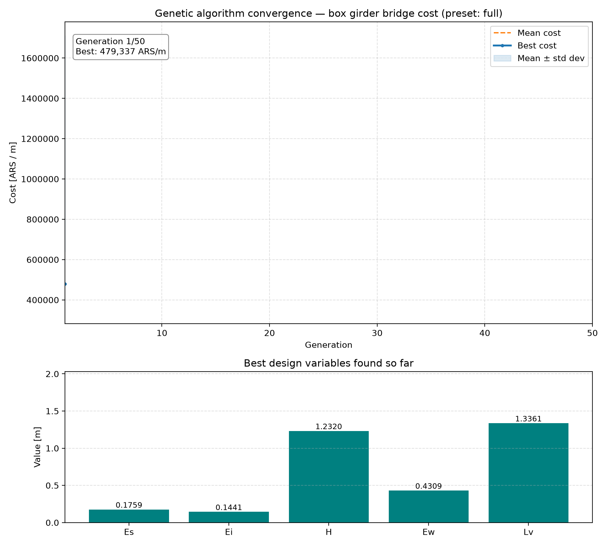

# Box Girder Bridge Optimization via Genetic Algorithms

A binary-encoded genetic algorithm (GA) that automates the pre-dimensioning of a post-tensioned, multicellular box girder bridge, minimizing material cost while satisfying structural safety requirements under **CIRSOC 801/802** (the Argentine adaptation of AASHTO LRFD).

Originally developed in MATLAB/Octave for my undergraduate Civil Engineering thesis, this repository is a from-scratch **Python port**, validated line-by-line and numerically against the thesis's own published results — including two real bugs found and fixed along the way (see [Engineering notes](#engineering-notes)).



## Table of Contents

1. [Background & Motivation](#background--motivation)
2. [Problem Statement](#problem-statement)
3. [How the Algorithm Works](#how-the-algorithm-works)
4. [Results](#results)
5. [Engineering Notes](#engineering-notes)
6. [Repository Structure](#repository-structure)
7. [Installation & Usage](#installation--usage)
8. [Limitations & Future Work](#limitations--future-work)
9. [Citation](#citation)
10. [License](#license)

## Background & Motivation

Structural bridge design is inherently **iterative**: engineers propose a preliminary geometry (a "pre-dimensioning"), verify it against code requirements, and adjust it repeatedly until the structure is both safe and economical. This process is typically guided by heuristics and prior experience, which often leads to conservative — and therefore materially inefficient — designs.

This project reformulates pre-dimensioning as a **constrained optimization problem**: given a set of geometric variables describing a box girder cross-section, find the combination that **minimizes total material cost** (concrete, prestressing steel, and conventional reinforcement) while satisfying every applicable structural verification.

Because the relationship between geometry, internal forces, and code compliance is highly non-linear and discontinuous (verifications behave like pass/fail switches), classical gradient-based optimization is poorly suited to this problem. A **genetic algorithm** — a stochastic, population-based search inspired by natural selection — was used instead, since it needs no gradient information and handles discontinuous, penalty-based objective functions naturally.

## Problem Statement

The case study is a **30-meter, isostatic, post-tensioned multicellular box girder bridge**, 13 meters wide, with 5 internal webs. The bridge's cross-section transitions from a **solid section** near the supports to a **hollow (voided) section** at mid-span — a common design strategy that saves material where bending demand is lower.

The optimization determines five independent geometric variables that fully define this cross-section, searching for the configuration that yields the lowest cost per linear meter of bridge, subject to strength and serviceability constraints defined by CIRSOC 801/802.

## How the Algorithm Works

### Design variables

| Variable | Symbol | Physical meaning |
|---|---|---|
| `X1` | `Es` | Top slab thickness [m] |
| `X2` | `Ei` | Bottom slab thickness [m] |
| `X3` | `H`  | Total section height [m] |
| `X4` | `Ew` | Web (soul) thickness [m] |
| `X5` | `Lv` | Cantilever (overhang) length [m] |

The void height used internally for section-property calculations is derived as `H_hueco = H - Es - Ei` (see [Engineering notes](#engineering-notes) for why this matters).

### Chromosome encoding

Each candidate solution is a **binary chromosome**: a 320-bit string partitioned into 5 genes of 64 bits each, one per design variable, decoded to a real value by linear interpolation between its lower and upper bound:

```
X_i = lower_i + (upper_i - lower_i) / (2^64 - 1) * decimal(segment_i)
```

### The objective function (`f_costo_viga.py`)

Given five decoded design variables, the objective function performs a full, code-compliant structural design:

1. **Section geometry** — area, centroid, moment of inertia, and section moduli for both the hollow (mid-span) and solid (support) sections.
2. **Load analysis** — permanent (self-weight, pavement, railings) and live loads (design truck + lane load) per CIRSOC 801, bending moments and shears at Service (SLS) and Ultimate (ULS) limit states.
3. **Prestressing design** — number and layout of post-tensioning strands, parabolic cable trajectory, simplified loss factors.
4. **Serviceability verification** — four concrete stress limits (top/bottom fiber, at transfer and at service); a failure adds a **large fixed penalty** (1,000,000 ARS/m) that effectively eliminates the candidate.
5. **Ultimate flexural design** — rectangular vs. T-shaped bending behavior, supplemental conventional reinforcement.
6. **Ultimate shear design** — transverse stirrup sizing via `Vci`/`Vcw`.
7. **Secondary checks** — cantilever bending/deflection, minimum slab-thickness-to-span ratio, web slenderness.
8. **Cost aggregation**:

```python
COST = penalty + Area_concrete * unit_cost_concrete \
              + Area_prestress_steel * unit_cost_prestress \
              + Area_conventional_steel * unit_cost_steel
```

> **Currency note:** unit costs (concrete, conventional steel, prestressing steel) are fixed constants dated **July 2023, Argentine pesos (ARS)**, taken directly from the thesis. Argentina's inflation since then has been extreme, so absolute cost figures below are only meaningful as *relative* comparisons within this project (AG vs. traditional method), not as current prices.

### Genetic operators (`GA_Bin.py`)

- **Selection:** roulette wheel, proportional to fitness rank.
- **Elitism:** best 2% of individuals carried unchanged into the next generation.
- **Crossover:** uniform crossover (random bit-mask swap) on even generations, single-point gene-aware crossover on odd generations.
- **Mutation:** 2% probability per individual of a single random bit flip.
- **Termination:** fixed generation count (default 50); convergence is visible as the population's standard deviation collapses toward zero.

## Results

Two design-space presets reproduce the thesis's own published Chapter 7 results almost exactly:

| Preset | Thesis result | Search space | This port | Thesis | Diff |
|---|---|---|---|---|---|
| `full` (default) | Resultado N6 — *"Sección óptima"* | All 5 variables free | **$444,054.74/m** | $443,951/m | **+0.02%** |
| `fixed_h_lv` | Resultado N7 | Es/Ei/Ew fixed at 0.20/0.20/0.30 m, only H & Lv searched | **$504,675.86/m** | $504,479/m | **+0.04%** |

### Headline comparison: GA vs. traditional pre-dimensioning

The thesis's Chapter 5 also produces a hand-calculated ("traditional method") section for the same bridge, using standard code-recommended minimums as a starting point. Comparing it against the `full`-preset GA result (Chapter 7):

| Variable | Traditional method | GA-optimized (`full`) |
|---|---|---|
| Es — top slab [m] | 0.250 | 0.175 |
| Ei — bottom slab [m] | 0.180 | 0.140 |
| H — total height [m] | 1.35 | 1.54 |
| Ew — web thickness [m] | 0.30 | 0.25 |
| Lv — cantilever [m] | 1.50 | 1.15 |
| Prestressing steel [m²/m] | 0.0210 | 0.0189 |
| Conventional steel [m²/m] | 0.0233 | 0.0125 |
| Concrete section [m²/m] | 6.78 | 5.89 |
| **Cost [ARS/m]** | **$552,340** | **$443,951** |

**Result: ~20% lower material cost** than the traditional hand-calculated design, for the same 30 m span and loading. The GA aggressively reduces conventional steel (-46%) and concrete section (-13%) by finding a taller, thinner-walled section than the code-minimum-driven manual approach would suggest.

Run it yourself to reproduce these numbers (see [Installation & Usage](#installation--usage)) — the animated GIF at the top of this README is the actual `full`-preset run.

## Engineering notes

Porting ~1,500 lines of MATLAB (appendix, `docs/thesis.pdf` pp. 269-299) to Python surfaced two real bugs, found by validating computed costs against the thesis's own published Chapter 7 numbers rather than assuming a line-by-line translation was correct:

1. **An inverted compression-stress check** that caused every candidate design to fail a serviceability check that should have passed — the original port never found a single feasible solution across a quarter-million evaluations.
2. **A variable-naming mismatch** between the thesis's design tables (which define the third gene as *total* section height) and the appendix code's internal naming (which treats it as *void* height) — invisible unless you cross-check the numbers, since both interpretations "run" without error.

Full write-up, including the MATLAB snippets that pinned down each bug and the before/after validation numbers, is in [`docs/CONVERSION_NOTES.md`](docs/CONVERSION_NOTES.md).

## Repository Structure

```
.
├── GA_Bin.py                          # Genetic algorithm engine (population, selection, crossover, mutation)
├── f_costo_viga.py                    # Structural objective function (cost + code verifications)
├── visualize_convergence.py           # Runs the GA and produces the static + animated plots
├── requirements.txt                   # Python dependencies
├── convergence_plot.png               # Static convergence plot ("full" preset)
├── convergence_animation.gif          # Animated convergence plot ("full" preset)
├── convergence_plot_fixed_h_lv.png    # Static convergence plot ("fixed_h_lv" preset)
├── convergence_animation_fixed_h_lv.gif
└── docs/
    ├── CONVERSION_NOTES.md            # MATLAB -> Python translation & bugfix notes
    └── thesis.pdf                     # Original thesis (Spanish)
```

## Installation & Usage

Requires **Python 3.10+** (the code uses `X | None` union type hints).

```bash
# 1. Clone the repository
git clone <repository-url>
cd <repository-folder>

# 2. Install dependencies
pip install -r requirements.txt

# 3. Run the optimization + visualization
python visualize_convergence.py
```

This runs the GA (default: population 5,000, 50 generations, the `full` preset) and produces `convergence_plot.png` + `convergence_animation.gif`.

**Useful flags:**

```bash
# Quick preview (a few seconds)
python visualize_convergence.py --psize 500 --ngener 30

# Reproduce the thesis's Resultado N7 instead of N6
python visualize_convergence.py --preset fixed_h_lv

# Save the PNG/GIF without opening any windows (e.g. on a server)
python visualize_convergence.py --no-show

# Static plot only, skip the (slower) animated GIF
python visualize_convergence.py --no-animate
```

Run `python visualize_convergence.py --help` for the full list of options (population size, generations, mutation rate, RNG seed, output filenames).

To run just the GA without any plotting:

```bash
python GA_Bin.py
```

## Limitations & Future Work

- The cost model and load assumptions are specific to this 30 m case study and CIRSOC 801/802; adapting to other spans or codes means editing `f_costo_viga.py`.
- Material unit costs are fixed July-2023 ARS figures baked into the cost function — meaningful only as relative comparisons, not current prices (see currency note above).
- Single-objective (cost only); a multi-objective extension (e.g. cost vs. carbon footprint) is a natural next step.
- The Python loop over the population is not vectorized to the degree MATLAB's array operations are; a 5,000 x 50 run still completes in under 10 seconds on a modern laptop, so this hasn't been a priority.
- As documented in `docs/CONVERSION_NOTES.md`, the SLS penalty-flag logic inherited from the MATLAB source collapses several independent checks onto a single shared flag. This was kept as-is (rather than "fixed" further) because it's what actually produced the thesis's published results — flagged here for anyone extending this code who wants stricter verification.

## Citation

If you use this work in academic research, please cite the original thesis:

```
Rivolta, N. I. (2023). Optimización de un puente de sección cajón multicelular
a partir de algoritmos genéticos [Undergraduate thesis, Universidad Nacional
del Nordeste]. Facultad de Ingeniería, Resistencia, Argentina.
Director: Dr. Juan Manuel Podestá. Codirector: Ing. Alejandro Ruberto.
```

## License

The source code (`GA_Bin.py`, `f_costo_viga.py`, `visualize_convergence.py`) is MIT-licensed — see [`LICENSE`](LICENSE). The thesis document (`docs/thesis.pdf`) is separate academic work with all rights reserved.
